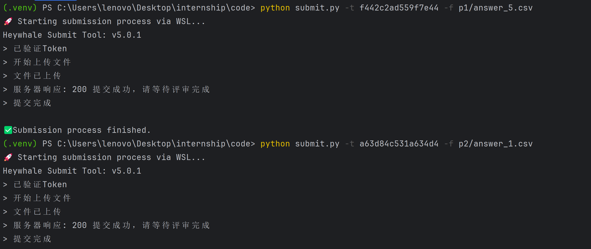

# HeyWhale 学习与竞赛解决方案


## 📖 项目简介

本仓库是我在 **[和鲸社区夏令营](https://www.heywhale.com/landing/2025summercamp)** 学习过程中的个人项目与解决方案集合。

仓库的核心内容包括：
1.  **各关卡作业的解决方案代码与提交文件**。
2.  一个自研的 **本地一键提交脚本 (`submit.py`)**，它能通过 WSL 在 Windows 本地环境中自动化地调用和鲸官方工具，极大地提高了提交作业的效率。
3.  一个**基于穷举法的单选题自动提交脚本 (`bruteforce_solver.py`)**，运行后可进行命令行交互，设置关卡题目属性，可以自动调用 (`submit.py`)提交，每次提交后根据使用者反馈的题目出错情况自动排除错误选项，最多***4***次尝试（小于每个关卡每天最多提交的***5***次）即可穷举过关。灵感来源于[LMQ](https://github.com/Lmq0)

这个项目不仅记录了我的学习成果，也展示了通过自动化工具优化工作流程的实践。

---

## 📂 项目结构

一个清晰的目录结构有助于快速理解项目内容。

```
.
├── p1/           # 章节1：熟悉python
│   └── 1.1.py     #1关卡的代码文件
│   └── answer_1.csv  #1关卡的答案提交文件
│   └── 1.2.py     #2关卡的代码文件
│   └── answer_2.csv  #2关卡的答案提交文件
├── ...                         # 其他关卡的解决方案
├── submit.py                   # 本地一键提交脚本
├── bruteforce_solver.py        # 基于穷举法的单选题自动提交脚本
└── README.md                   
```

## 🚀 本地一键提交工具 (`submit.py`)

为了避免每次都在 Web 端手动上传或登录 WSL 操作，我编写了这个自动化脚本，具体的使用详情见[submit_readme.md](./submit_readme.md)   
使用该脚本在pycharm的终端中提交作业的效果如下：


### ✨ 特性
* **一键执行**: 在 Windows 终端中运行单行命令即可完成提交。
* **自动适配**: 脚本自动检测项目路径，无需硬编码，具有良好的移植性。
* **清晰反馈**: 实时回显官方工具的输出，无论是成功还是失败信息都一目了然。

### 🔧 环境要求
* **Python 3**: 已安装并配置了 `PATH` 环境变量。
* **WSL**: 已安装并可正常运行一个 Linux 发行版 (如 Ubuntu)。

### ⚙️首次配置
1.  将本项目克隆或下载到本地。
2.  打开 **WSL 终端**，`cd` 进入本项目所在的目录 (e.g., `cd /mnt/d/HeyWhale-Assignments-Solutions`)。
3.  运行以下命令下载官方CLI工具：
    ```bash
    wget -nv -O heywhale_submit [https://cdn.kesci.com/submit_tool/v4/heywhale_submit](https://cdn.kesci.com/submit_tool/v4/heywhale_submit) && chmod +x heywhale_submit
    ```

### ⌨️ 如何使用
在 **Windows Terminal (PowerShell 或 CMD)** 中进入项目根目录，使用以下命令提交：
```bash
python submit.py -t <你的Token> -f <答案文件的相对路径>
```
**示例:**
```bash
python submit.py -t 5f1ba9f600843e65 -f p1_data_cleaning/answer_1.csv
```

## 💡 单选题自动穷举脚本 (`bruteforce_solver.py`)

这个实习其实很无聊，但学分还是得拿到手。对于只有唯一答案的选择题关卡，手动试错非常繁琐。本脚本可以将这一过程自动化，智能地“猜”答案。

### ✨ 特性

  * **交互式设置**：通过问答形式配置关卡、题目数量等信息。
  * **智能穷举**：自动记录并排除错误答案，只对失败的题目进行重试，不会影响已正确的答案。
  * **全自动提交**：内嵌式调用 `submit.py`，无需用户二次操作。

### ⌨️ 如何使用

在项目根目录运行，脚本会引导你完成后续所有步骤。更详细的说明请参考 [**bruteforce_solver_readme.md**](./bruteforce_solver_readme.md)。

```bash
python bruteforce_solver.py
```

## 📄 许可证 (License)

本项目采用 [MIT License](https://opensource.org/licenses/MIT) 授权。
