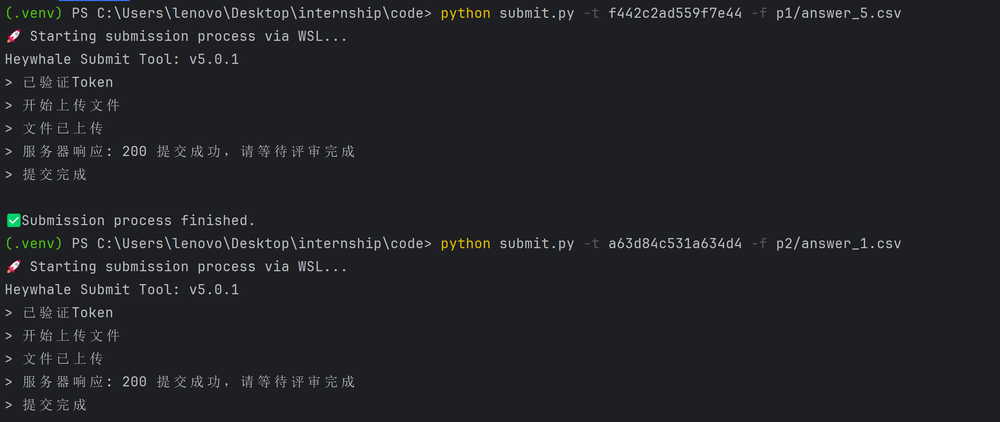

## 和鲸社区本地一键提交工具 README (极速版)

`v1.1.0`

🚀 本脚本旨在通过 WSL 自动化调用和鲸官方提交工具，实现在 Windows 本地终端中的一键提交。

### ✅ 前提条件 (Prerequisites)

请确保你的 Windows 环境满足以下条件：

  * **Python 3**: 已安装并正确配置了 `PATH` 环境变量。
  * **WSL**: 已安装并可正常运行一个 Linux 发行版 (如 Ubuntu)。

-----
### 使用效果
使用该脚本在pycharm的终端中提交作业的效果如下：

---

## 🚀 使用步骤

### 1\. 初始化项目文件夹 (一次性操作)

这一步的目的是将我们的自动化脚本和官方的提交工具都准备好。

1.  **准备文件**:

      * 在你的电脑上创建一个项目主文件夹 (e.g., `D:\Kesci`)。
      * 将 `submit.py` 这个脚本文件放入该文件夹。

2.  **下载官方工具**:

      * 打开 WSL 终端 (e.g., `Ubuntu`)。
      * 使用 `cd` 命令进入你的项目文件夹。**务必使用 WSL 的路径格式**。
          * **路径转换规则**: `C:\` 变为 `/mnt/c/`，`D:\` 变为 `/mnt/d/`。
          * **示例**: 如果项目在 `D:\Kesci`，则命令为：
            ```bash
            cd /mnt/d/Kesci
            ```
      * 在此目录下，运行以下命令下载并授权官方 CLI 工具：
        ```bash
        wget -nv -O heywhale_submit https://cdn.kesci.com/submit_tool/v4/heywhale_submit && chmod +x heywhale_submit
        ```
      * 命令执行后，`heywhale_submit` 文件会出现在你的项目文件夹里。至此，初始化完成。

### 2\. 执行提交 (日常使用)

每次提交作业时，只需执行以下操作。

1.  在 **Windows Terminal** (推荐使用 PowerShell 或 CMD) 中，进入你的项目主文件夹。

      * **快捷技巧**: 在文件资源器的地址栏输入 `powershell` 或 `cmd` 并回车。

2.  使用以下命令格式运行脚本：

    ```bash
    python submit.py -t <YOUR_TOKEN> -f <PATH_TO_YOUR_ANSWER_FILE>
    ```

3.  **参数说明**:

      * `-t, --token`: **必需**. 你在和鲸官网复制的对应关卡的 Token。
      * `-f, --file`: **必需**. 你的答案文件相对于项目主文件夹的**相对路径** (e.g., `p1/answer.csv` 或 `answer.csv`)。

4.  **实际示例**:

    ```bash
    # 提交位于主文件夹下 p1/ 目录中的 answer.csv 文件
    python submit.py -t 5f1ba9f600843e65 -f p1/answer.csv
    ```

脚本会自动完成后续所有操作，并将官方工具的返回结果实时显示在你的终端中。

-----

### 💡 工作原理

脚本通过 `subprocess` 模块调用 `wsl.exe`。它将当前 Windows 工作目录转换为对应的 `/mnt/...` 路径，然后构造一个 `bash -c "cd ... && ./heywhale_submit ..."` 命令，从而在正确的目录下执行提交。脚本捕获 `stdout` 并以 `utf-8` 解码，同时将 `stderr` 重定向到 `DEVNULL` 以屏蔽 WSL 启动时的网络状态信息，保证输出干净。

### ❓ FAQ

1.  **脚本报错 `heywhale_submit: not found` 或类似信息？**

      * **原因**: 你没有在 WSL 中成功下载官方工具，或者存放位置不正确。
      * **解决**: 请仔细执行 **初始化项目文件夹** 的第2步，确保 `heywhale_submit` 和 `submit.py` 在同一个目录下。

2.  **脚本报错 `FileNotFoundError`，提示我的 `.csv` 文件找不到？**

      * **原因**: `-f` 参数提供的相对路径有误。
      * **解决**: 检查文件路径和拼写。路径相对于项目主文件夹，推荐使用正斜杠 `/`。

3.  **输出显示 Token 错误/关卡不匹配等信息？**

      * **原因**: 这不是脚本的 bug，而是脚本成功运行了官方工具后，官方工具返回的业务逻辑错误。
      * **解决**: 请去和鲸官网检查你的 Token 是否正确或当前关卡是否匹配。